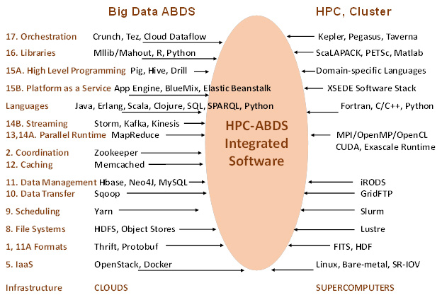
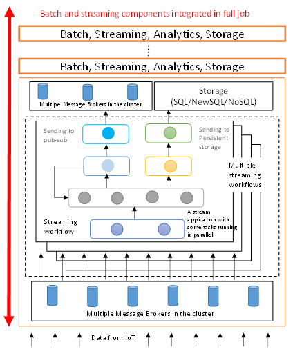

MIDAS
=====

MIDAS Architecture
------------------

It is our goal to study major software components relevant for Big Data
from both HPC and commodity Big Data processing. At 10 zettabytes, the
total commodity Big Data is far larger than science data (with LHC
analysis at “just” 100 petabytes) and has motivated the development of
much high quality software which we collectively term ABDS – Apache Big
Data Stack. As HPC has a leadership position in some areas – especially
those associated with performance – we suggest a need to merge software
systems giving. The result is what we call HPC-ABDS software stack,
which currently has over 300 entries arranged into 21 “layers” with
those where HPC and ABDS have important integration issues identified.
The recent announcements [need a citation] that HPC is essential for
deep learning have supported these ideas. Interoperation of cloud,
supercomputer, multicore, GPU, and Xeon Phi systems is clearly
important.

|Big Data Stack HPC-ABDS|
-------------------------

Identifying HPC-ABDS Software Stack
-----------------------------------

The image below gives a comparison of typical cloud and supercomputer
software layered stacks.

|HPC-ABDS Cloud/Supercomputer Stacks|
-------------------------------------

-  Research paper `here <http://hpc-abds.org/kaleidoscope/>`__.
-  Research paper
   `here <http://grids.ucs.indiana.edu/ptliupages/publications/nist-hpc-abds.pdf>`__.
-  Research paper `here <http://arxiv.org/abs/1403.1528>`__.
-  Research paper
   `here <http://www.exascale.org/bdec/sites/www.exascale.org.bdec/files/whitepapers/fox.pdf>`__.
-  Research paper
   `here <http://dsc.soic.indiana.edu/publications/HPC-ABDSDescribedv2.pdf>`__.

HPC-ABDS Further/Ongoing work:

#. Continue development of online Class
#. Develop a set of examples of HPC-ABDS for benchmark and tutorial
   purposes. Specify with DevOps technologies (Ansible, Heat)
#. Relate DevOps specified examples to NIST Big Data Reference
   Architecture (Interest of NIST Public working group)

Batch Parallel Programming
--------------------------

This section covers the integration of Hadoop into the Pilot Jobs
framework (`link <http://arxiv.org/abs/1501.05041>`__) more details of
which can be found in the `Software <http://dsc-spidal.github.io/www/software.html>`__ page, and the
Harp scientific (high performance) plug-in for Hadoop which benchmarks
GML5
(`link <http://grids.ucs.indiana.edu/ptliupages/publications/HarpQiuZhang.pdf>`__).

Streaming Data
--------------

The following diagram illustrates the Apache Storm method of processing
data from the Internet of Things (IoT).

|Big Data Stack HPC-ABDS|

-  Research paper
   `here <http://dsc.soic.indiana.edu/publications/iotcloud_hindavi_two_column_final_2.docx>`__.
-  Research paper
   `here <http://dsc.soic.indiana.edu/publications/Xiaoming%20Gao%20Thesis%20v5.pdf>`__.
-  Research paper
   `here <http://dsc.soic.indiana.edu/publications/intelligent_iot_cloud_controller.pdf>`__.
-  Research paper
   `here <http://dsc.soic.indiana.edu/publications/Parallel%20Clustering%20of%20High-Dimensional%20Social%20Media%20Data%20Streams_v11.pdf>`__.

MIDAS Ongoing Work

#. Apply Storm-RabbitMQ to Robotics
#. Improve Storm to add quality of service and support of parallel
   computing
#. Extend Tweet clustering to use Harp
#. Look at further examples of Harp
#. Integrate Pilot Jobs with Streaming and Harp
#. Support GPU and Xeon Phi

.. |Big Data Stack HPC-ABDS| image:: images/figures/kaleidoscope.jpg

