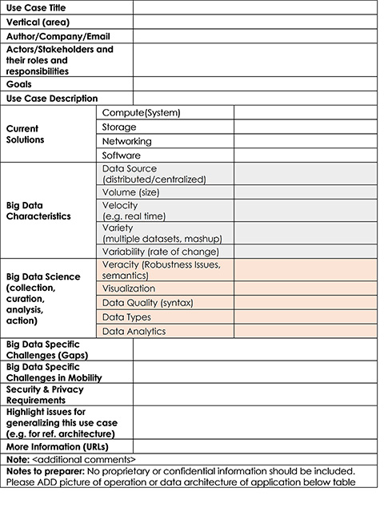
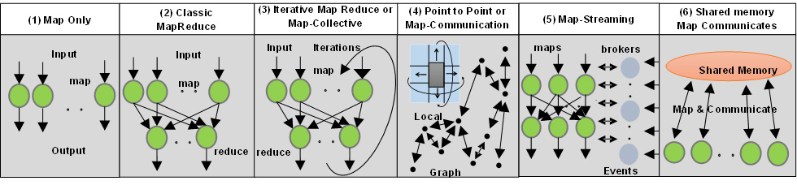
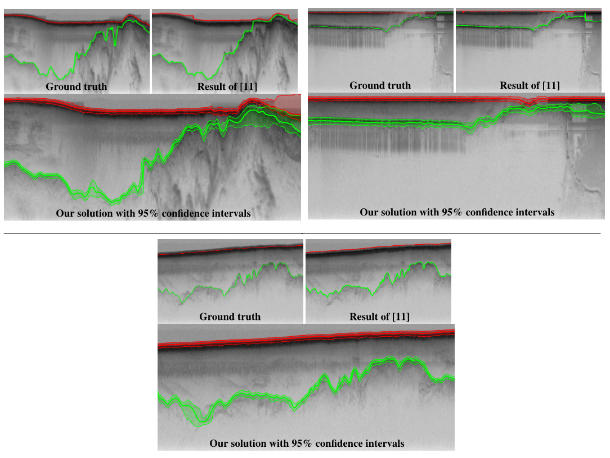
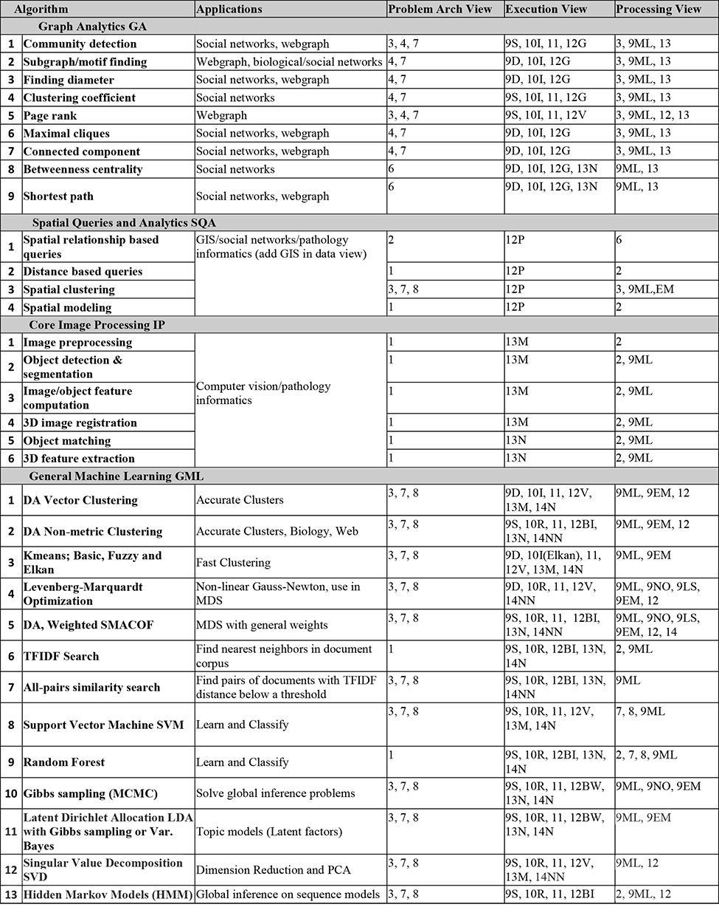

Spidal
======

Architecture
------------

General Study of Big Data Applications
^^^^^^^^^^^^^^^^^^^^^^^^^^^^^^^^^^^^^^

As part of our research into Big Data and its potential benchmarks, we
have gone about collecting relevant applications and their features, the
key properties of which are summarized later. This also includes efforts
to identify and classify requirements and compare them to the NIST
Reference Architecture. Below you can view a copy of a template with 26
features used to record Big Data Applications in the NIST process.
Piyush Mehrotra, division chief of the NASA Advanced Supercomputing
division, has joined as co-chair on the project and will gather more
NASA applications.

-  Research paper
   `here <http://bigdatawg.nist.gov/V1_output_docs.php>`__.
-  Research paper
   `here <http://grids.ucs.indiana.edu/ptliupages/publications/NISTUseCase.pdf>`__.

|26 Feature Template|
^^^^^^^^^^^^^^^^^^^^^

General Analysis of Features of Big Data Applications
^^^^^^^^^^^^^^^^^^^^^^^^^^^^^^^^^^^^^^^^^^^^^^^^^^^^^

Through persistent research in this area we have identified around 50
salient features of Big Data (Ogres) and divided them into four views or
dimensions: Problem Architecture (or Structure); Execution mode; Data
Source, Storage and Access; and the Processing algorithms used. We in
turn used this to match applications to suitable systems (hardware,
software) and group applications together. Later work focused on
understanding needed benchmarks by probing all facets of Big Data
problems. Below you can see 6 System Architectures identified in the
Ogre Problem Architecture Classification.

-  Research paper
   `here <http://dsc.soic.indiana.edu/publications/OgrePaperv9.pdf>`__.

|6 Ogres|
^^^^^^^^^

General Big Data Application Activity Further/Ongoing work
^^^^^^^^^^^^^^^^^^^^^^^^^^^^^^^^^^^^^^^^^^^^^^^^^^^^^^^^^^

#. Understand Public comments on NIST Collection
#. Accumulate further examples (part of NIST Public Working Group)
#. Improve 26-feature Template
#. Refine facets

Spidal Kernels
--------------

This work refines and exemplifies the Ogre facets, which include core
machine learning and other kernels, as well as those related to data
systems. In order to tie in to previously established Big Data
guidelines we set out to catalog existing benchmark sets and label them
with corresponding Ogre facets. Kernels identified in SPIDAL are also
related to Ogres. Continuing work will serve to identify those facets
not covered so far. Reference paper 3 below studies SPIDAL clustering
algorithms General Machine Learning (GML) 1 and 2.

-  Research paper
   `here <http://www.exascale.org/bdec/sites/www.exascale.org.bdec/files/whitepapers/OgreFacets.pdf>`__.
-  Research paper
   `here <http://dsc.soic.indiana.edu/publications/proposal_final_v3.docx>`__.
-  Research paper
   `here <http://grids.ucs.indiana.edu/ptliupages/publications/OgreFacetsv9.pdf>`__.

|4Views|
^^^^^^^^

Big Data Benchmarking
^^^^^^^^^^^^^^^^^^^^^

Below is a list of the members of SPIDAL library and the Ogre facets
that they support. There are no SPIDAL library members directly
addressing Data Source & Style View (except spatial analytics and GIS)
and so that view is omitted.

|Ogre Facet Benchmark List|
^^^^^^^^^^^^^^^^^^^^^^^^^^^

SPIDAL Kernels Big Data Benchmarking Further/Ongoing work:

* Package existing Kernels

* Examine Intel DaaL/Mahout/MLlib

* Document SPIDAL use of Github

* Implement missing algorithms

* Consider implications of GPUs and Xeon Phi “Knights landing”

SPIDAL Communities
------------------

Remote Sensing -- Kansas
^^^^^^^^^^^^^^^^^^^^^^^^
The images below display Kansas radar images measuring glacier beds with
results of new machine learning algorithms identifying the top (red) and
bottom (green) of the glaciers. Results of earlier work are labeled as
[11]. Ground Truth is human generated analysis.

-  Research paper
   `here <http://dsc.soic.indiana.edu/publications/ICIPpaper.pdf>`__.
-  Research paper
   `here <http://proceedings.spiedigitallibrary.org/proceeding.aspx?articleid=1758665>`__.

|Glacier Readings|
^^^^^^^^^^^^^^^^^^

Pathology Informatics – Stony Brook University
^^^^^^^^^^^^^^^^^^^^^^^^^^^^^^^^^^^^^^^^^^^^^^
Digital pathology images or whole slide images are generated through
scanning human tissue specimens with high resolution microscope
scanners. Examination of high resolution whole slide images enables more
effective diagnosis, prognosis and prediction of cancer and other
important diseases. Recently, 3D examinations of tissues at microscopic
resolution have become possible, with significant potential to enhance
the study of normal and disease processes through 3D spatial analytics.
Pathology image analysis segments massive spatial objects such as nuclei
and blood vessels, represented with their boundaries, along with many
extracted image features from these objects. The spatially derived
information is used for complex queries and analytics to support
biomedical research. Scalable methods for pathology image analytics will
be essential to realize the potential power of pathology imaging. We
will provide a generic parallel image processing pipeline that supports
different image analysis algorithms with HPC-ABDS.
  

.. |4Views| image:: images/figures/x-y-ogre.jpg

